# Common-Subject UMAP Plots {#common-subject-distances}

This section presents the UMAP plots for the benchmarks' composite distance, with each figure showing the plots of one imputation method. Each plot is composited over the standard and aggressive collapse strategies. The aggregate plots are composited over all collapse strategies and all imputation methods. Since the R and raw datasets only have 1 valid imputation each, they do not have a dedicated aggregate figure. This section has 16 figures in total.

Notably, through the different imputation strategies, all of the visualizations show the same pattern, in which shared-domain benchmarks tend to be dispersed across the vector space. Highlighting the same benchmarks as in the results (with some benchmarks discarded by each densifier), we see the same pattern that, for example, `aime25` and `gsm8k` are distanced quite far from each other. Through most of the different possible solutions, our core claim that same-domain benchmarks are not guaranteed to cluster together is robust.

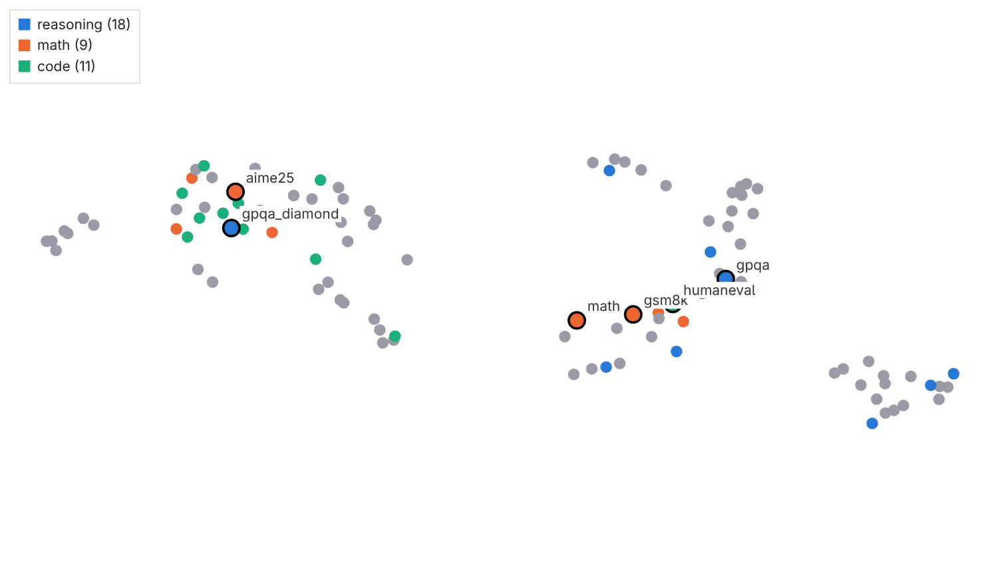
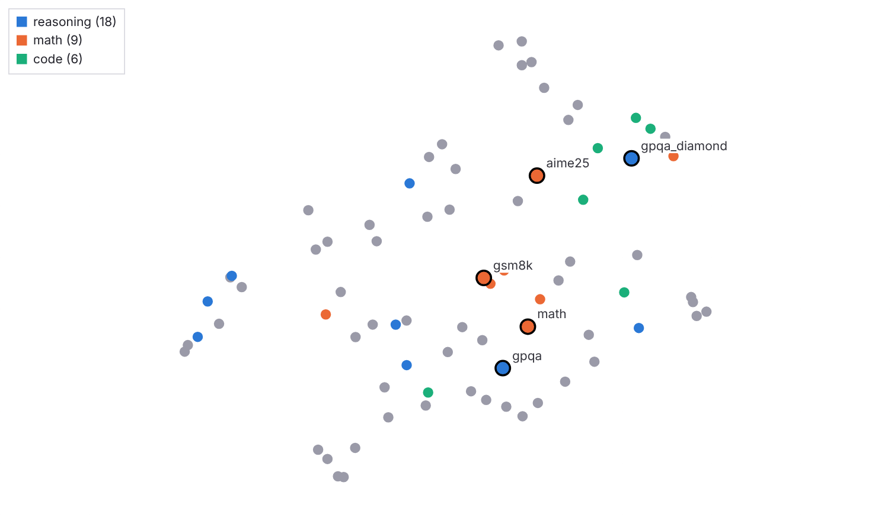
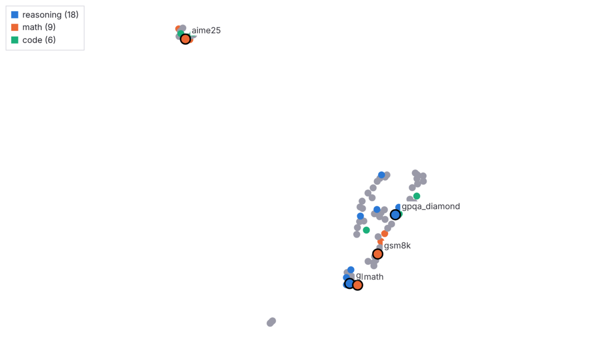
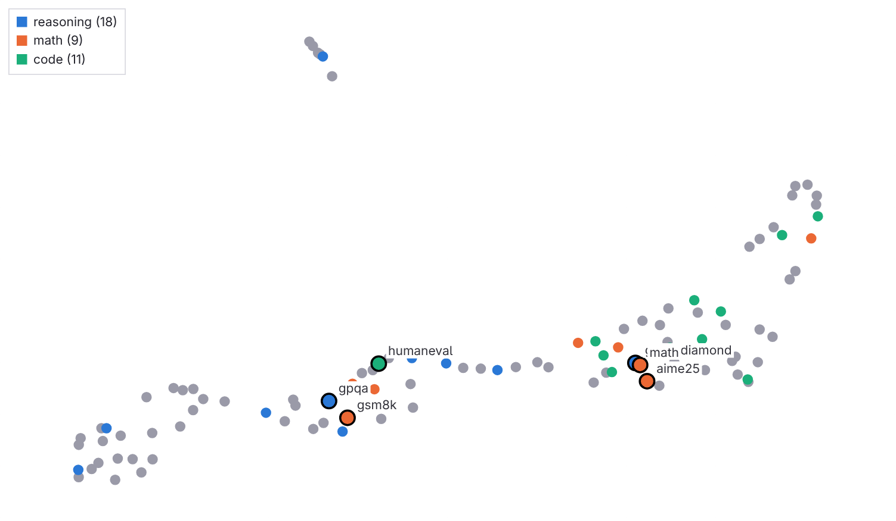
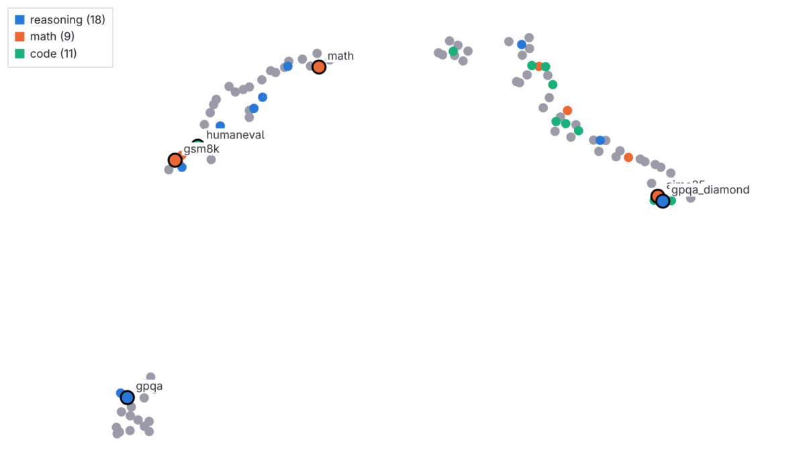
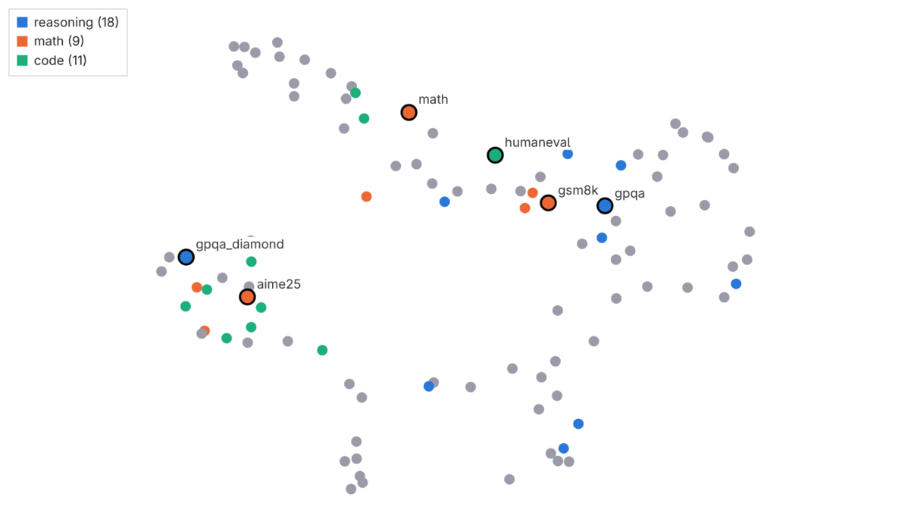
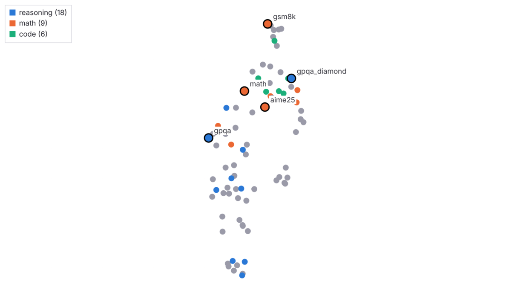
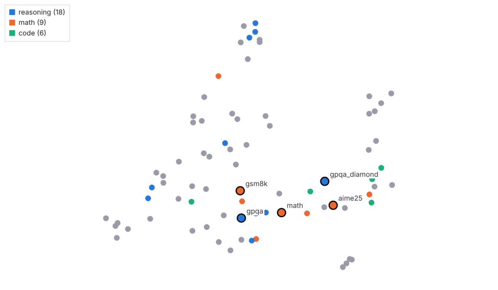

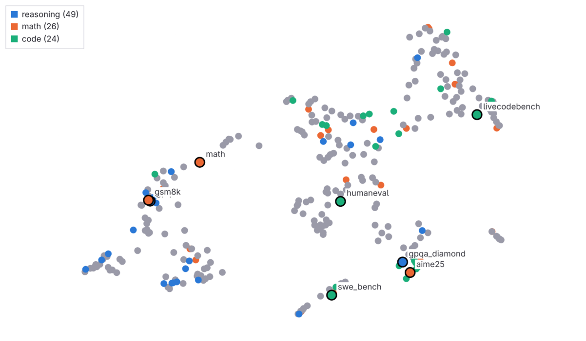
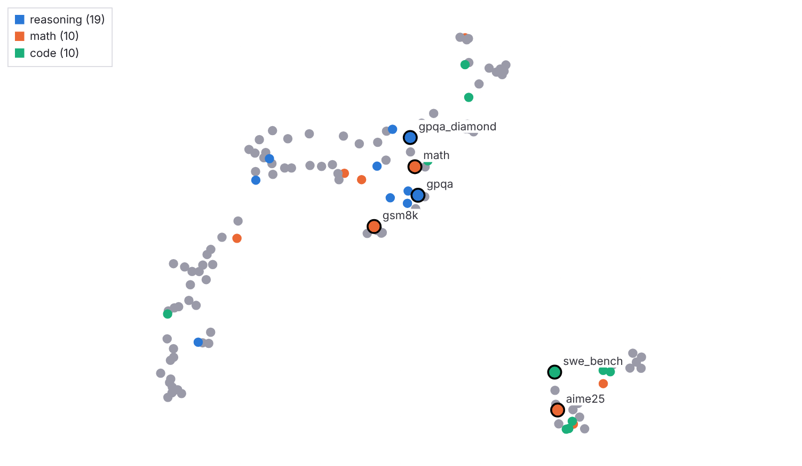
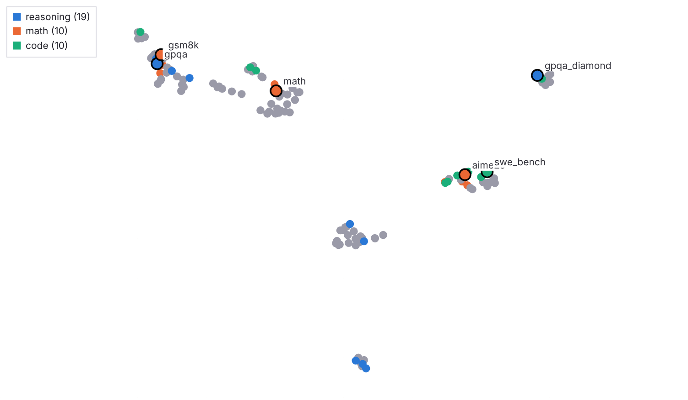
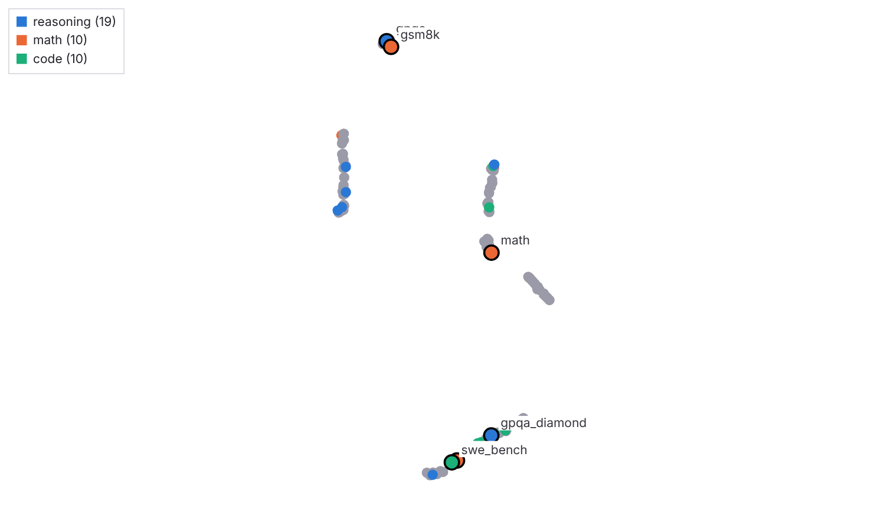
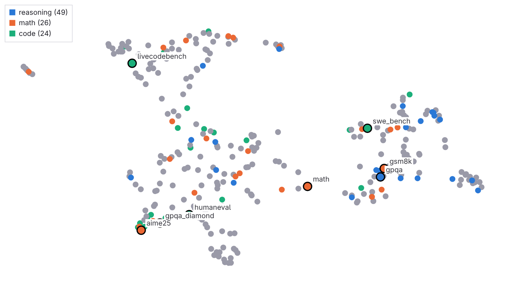
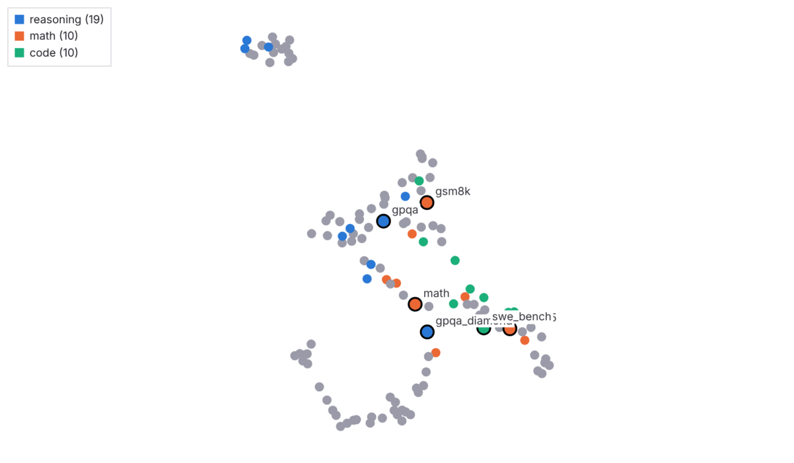

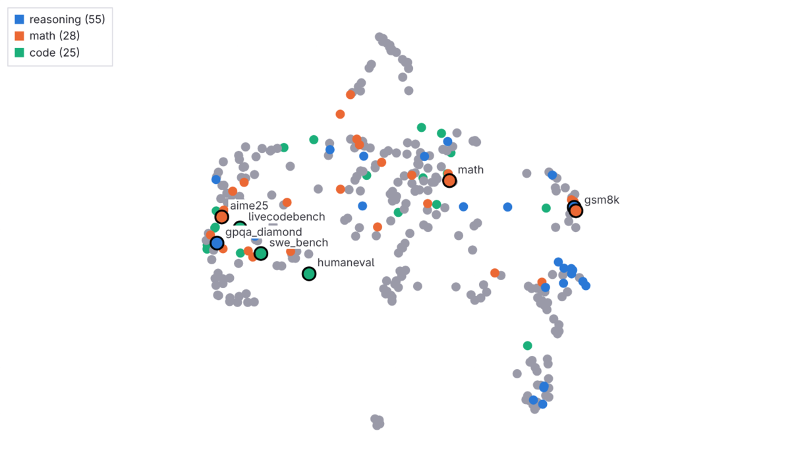
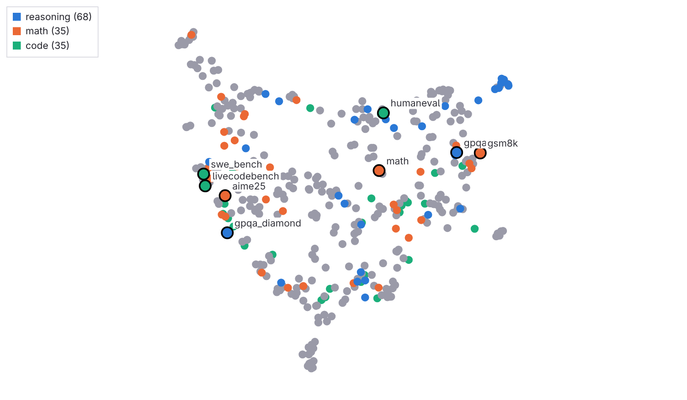
